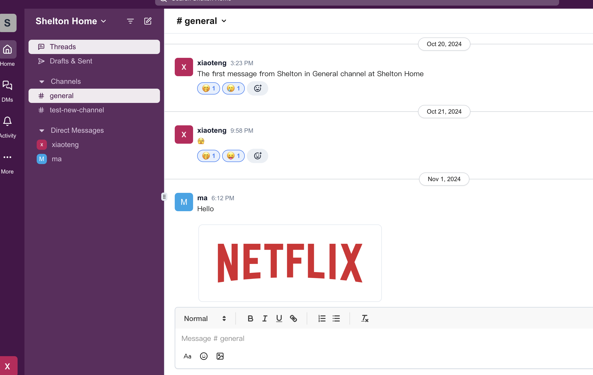

# Slack

Slack deploy on vercel: [https://slack.sheltonma.top](https://slack.sheltonma.top)



## Installation

```shell
pnpm install
```

run

```shell
pnpm run dev
```

Environment Variables

```.env
// .env.local
CONVEX_DEPLOY_KEY=

```

## Key Features

- Built with **Next.js 14** framework  
- UI crafted with **Shadcn UI** and **TailwindCSS**  
- Authentication handled by **Auth.js**
- Database integration with **Convex**  
- State management powered by **Jotai**
